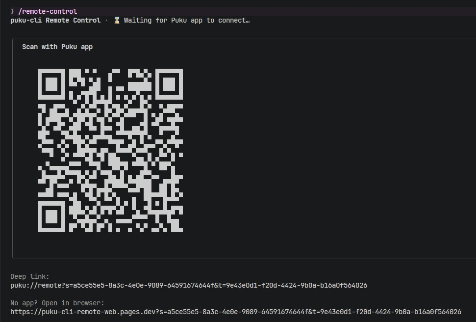
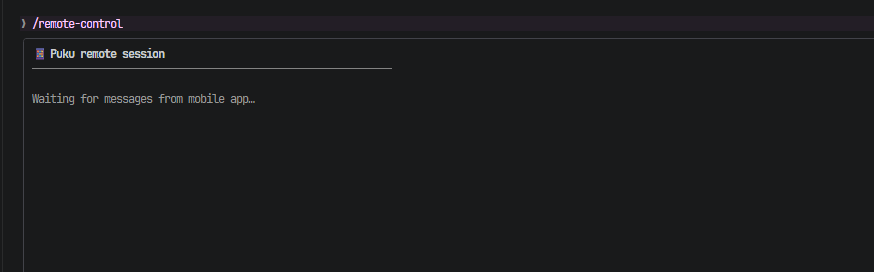
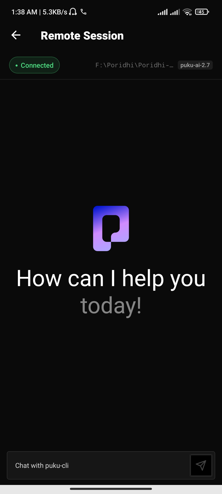
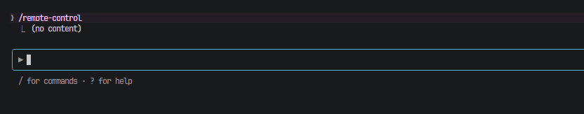
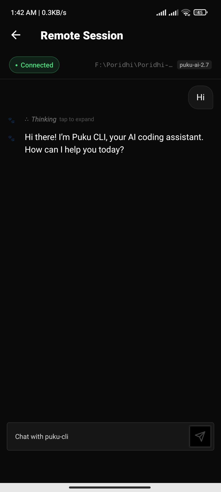
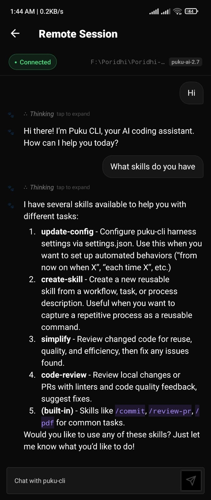
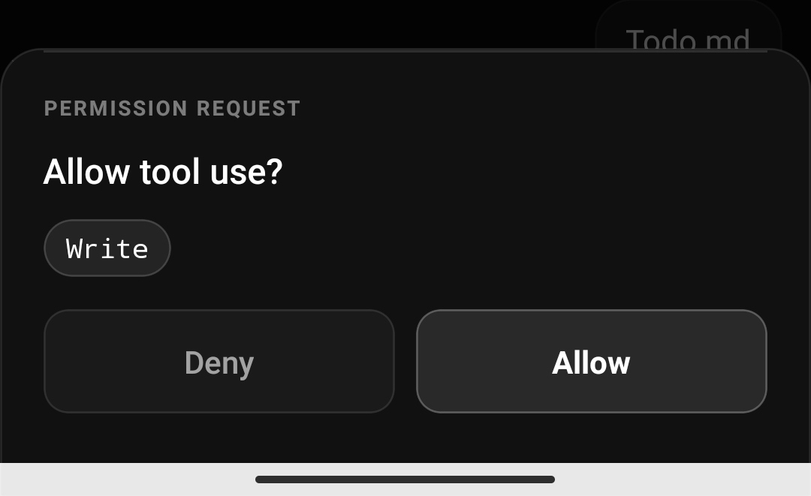

# Puku App — Remote Control

> Control your Puku CLI session from anywhere using the Puku mobile app.

## Table of Contents

- [Overview](#overview)
- [How it works](#how-it-works)
- [Requirements](#requirements)
- [Connecting](#connecting)
  - [Start a remote session](#start-a-remote-session)
  - [Pair the mobile app](#pair-the-mobile-app)
- [Using the app](#using-the-app)
  - [Sending messages](#sending-messages)
  - [Session tabs and history](#session-tabs-and-history)
  - [Thinking indicator](#thinking-indicator)
  - [Responding to permission prompts](#responding-to-permission-prompts)
- [Ending a session](#ending-a-session)

## Overview

The Puku App is a React Native mobile client that lets you drive a `puku-cli` terminal session from your phone or tablet. Once connected, every message you send in the app is forwarded to the running CLI process — the agent reads files, runs commands, edits code, and streams its reply back to your screen in real time.

The connection is end-to-end relayed through a Cloudflare edge bridge, so your terminal does not need to be publicly reachable. The CLI initiates the connection outbound; the app joins the same relay channel using a pairing code.

---

## How it works

1. You run `/remote-control` inside a `puku-cli` session.
2. The CLI registers a relay channel and displays a pairing code (or QR code).
3. You open the Puku App and enter the pairing code, or scan the QR code.
4. The app joins the relay channel. Messages flow bidirectionally from that point on.
5. The CLI continues to run on your machine — the app is a remote interface, not a standalone agent.

---

## Requirements

- **Puku CLI v1.8.9 or later** installed and working (`puku-cli --version`)
- **Puku mobile app** installed on your device (iOS or Android)
- An active `puku-cli` session open in a terminal on your machine
- Internet connectivity on both the machine running the CLI and the mobile device

---

## Connecting

### Start a remote session

Inside any active `puku-cli` session, type the slash command:

```bash
/remote-control
```

The CLI will:

1. Print a **pairing code** and (where the terminal supports it) a **QR code**
2. Display the relay session ID and a status line showing `waiting for app connection…`

Example output:



Keep this terminal window open. The session is live for as long as the CLI process is running.

### Pair the mobile app

**On your phone or tablet:**

1. Open the **Puku App**
2. Choose one of:
   - **Scan QR code** — point your camera at the QR code in the terminal
   - **Enter code manually** — type the pairing code shown in the terminal (e.g. `XKCD-7742`)
3. Tap **Connect**

Once the handshake completes, the terminal status line updates to:



The app's chat screen opens.



Then press the Esc button in the terminal, it show like this:



Then start chatting in the App:




## Using the app

### Sending messages

Type your message in the input field at the bottom of the chat screen and tap the send button (or press Return on a hardware keyboard). Messages are forwarded to the CLI in real time. The agent's streamed response appears in the chat view as it arrives.



---

### Thinking indicator

When the agent is processing a complex request, the app displays a thinking indicator in the chat header. This matches the spinner visible in the terminal. The input field is disabled while the agent is thinking to prevent out-of-order messages.

---

### Responding to permission prompts

When the CLI needs to execute a tool that requires confirmation (file deletion, shell command with side effects, etc.), a **permission prompt** appears in the app as an action card:



Tap **Allow** or **Deny** to send your decision back to the CLI. The terminal reflects your choice immediately and proceeds (or halts) accordingly.

> If you close the app while a permission prompt is pending, the CLI will wait until the timeout elapses and then deny the action by default.

---

## Ending a session

**From the terminal:**

Press `Ctrl+C` at the `/remote-control` status screen, or exit the `puku-cli` session normally. The relay channel closes and the app shows the session as `ended`.


> **Further help:** File an issue at the [puku-cli-issues tracker](../../issues/new/choose) with your `puku-cli --version`, OS, and a description of what happened.
